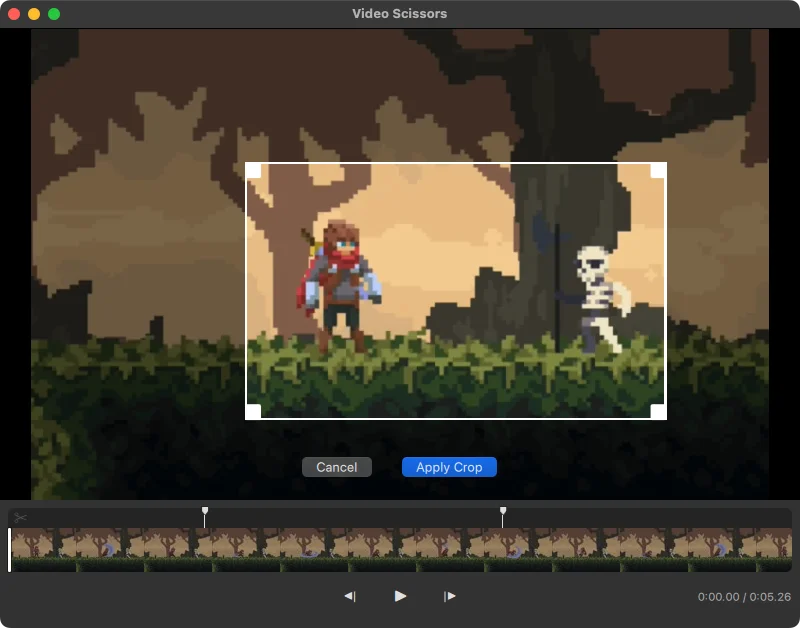

# ✂️ Video Scissors

A fast, focused video editor for quick edits. Crop, cut, and export.



## Install

Requires Python 3.12+ and [uv](https://docs.astral.sh/uv/).

```
uv sync
```

FFmpeg must be available on your `PATH`.

## Usage

```
make run
```

Or open a file directly:

```
make run FILE=video.mp4
```

## Development

```
make check    # lint + typecheck + test
make test     # tests (headless)
make test-gui # tests with visible window
make lint     # ruff lint + format
```

## Tech Stack

- **Python** + **Qt Quick/QML** via PySide6
- **FFmpeg** for media processing (via PyAV)
- **uv** for dependency management
- **ruff** for linting and formatting, **ty** for type checking

## License

MIT
